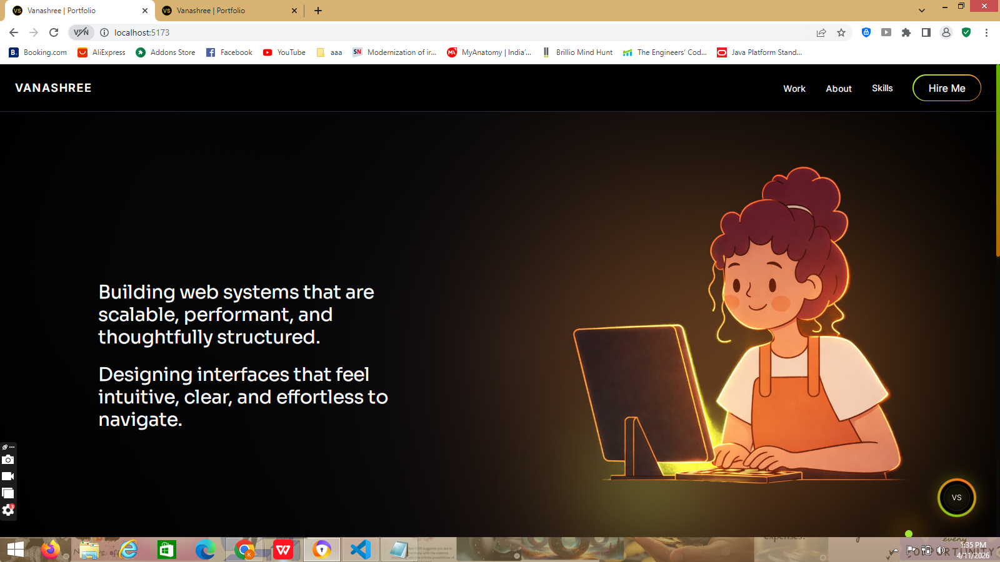
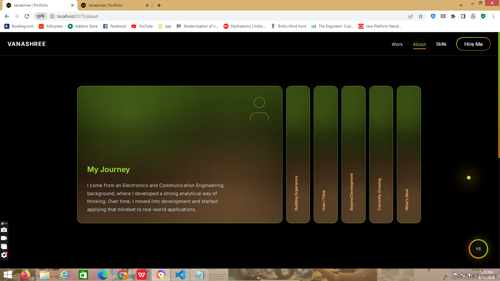
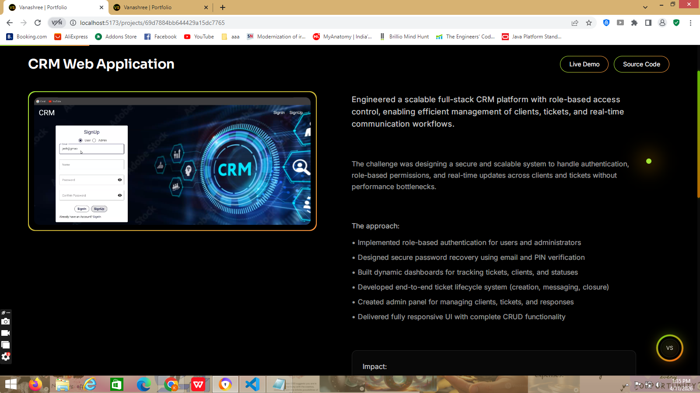

# Vanashree – Portfolio.v2

A modern, interactive fullstack developer portfolio built with React, showcasing my projects, skills, and approach to building clean, user-focused applications.

 **Live:** https://vanashree-portfolio-site.vercel.app

---

##  Highlights

* Smooth animations & micro-interactions
* App-like navigation experience
* Fully responsive, mobile-first design
* Interactive skills & project showcase
* Clean dark UI with gradient accents
* Custom cursor glow for enhanced interactive experience  

---

##  Preview

### Hero Section

### About Section

### Project Case Study

---

## Tech Stack

React • JavaScript • Tailwind CSS • Framer Motion
Node.js • Express • MongoDB • Git

---

## Projects

* CRM Web Application – Fullstack system for managing clients, tickets, and workflows
* Portfolio Website – Interactive portfolio with modern UI and backend-driven contact system
* Visual Node Pipeline Builder – Drag-and-drop workflow builder with real-time connections
* Static Portfolio – Initial version focused on structure and accessibility

---

## Features

* Smooth page transitions and animations
* Interactive UI components
* Project case studies with real-world context
* Contact modal for quick interaction

---
 Open to remote opportunities
